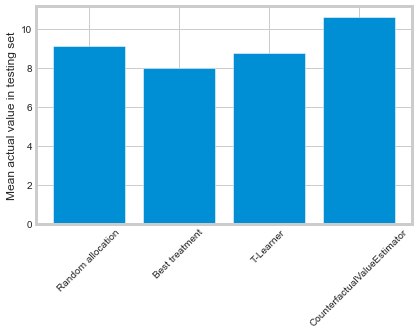
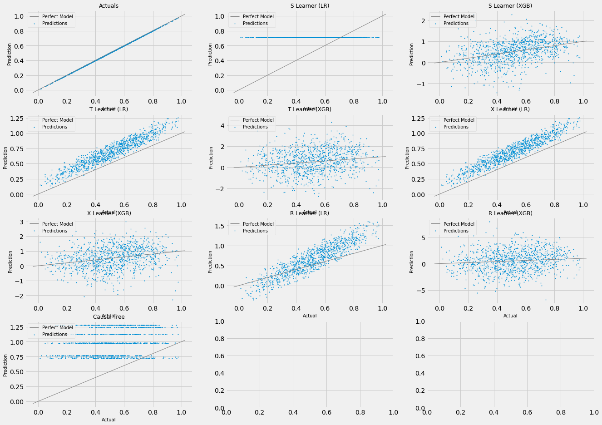
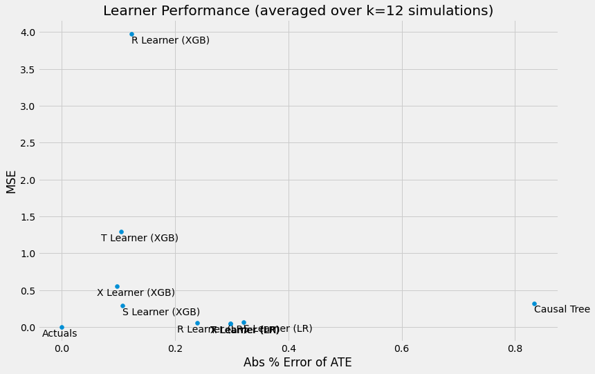
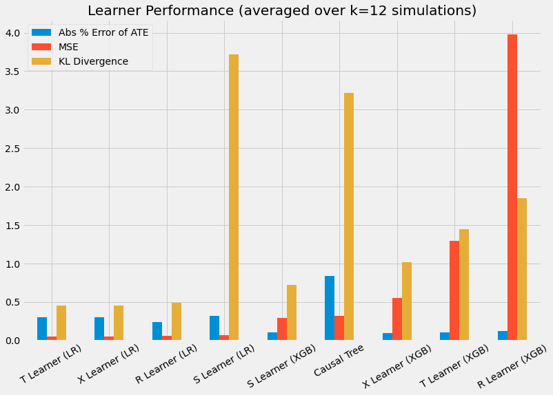
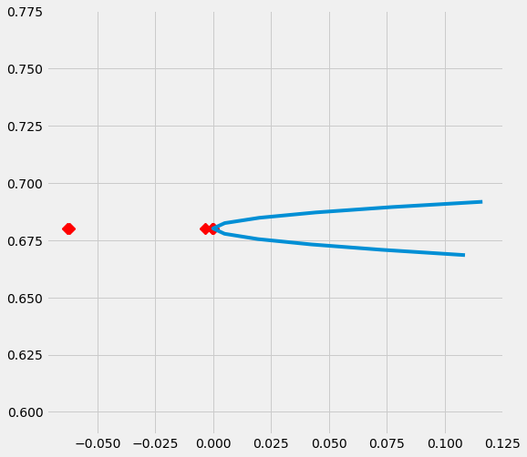

Examples
========

Working example notebooks are available in the `example folder <https://github.com/uber/causalml/tree/master/examples>`_.

Propensity Score
----------------

Propensity Score Estimation
~~~~~~~~~~~~~~~~~~~~~~~~~~~

.. code-block:: python

    from causalml.propensity import ElasticNetPropensityModel

    pm = ElasticNetPropensityModel(n_fold=5, random_state=42)
    ps = pm.fit_predict(X, y)

Propensity Score Matching
~~~~~~~~~~~~~~~~~~~~~~~~~~

.. code-block:: python

    from causalml.match import NearestNeighborMatch, create_table_one

    psm = NearestNeighborMatch(replace=False,
                               ratio=1,
                               random_state=42)
    matched = psm.match_by_group(data=df,
                                 treatment_col=treatment_col,
                                 score_cols=score_cols,
                                 groupby_col=groupby_col)

    create_table_one(data=matched,
                     treatment_col=treatment_col,
                     features=covariates)

Average Treatment Effect (ATE) Estimation
-----------------------------------------

Meta-learners and Uplift Trees
~~~~~~~~~~~~~~~~~~~~~~~~~~~~~~

In addition to the Methodology section, you can find examples in the links below for :ref:`Meta-Learner Algorithms` and :ref:`Tree-Based Algorithms`

- Meta-learners (S/T/X/R): `meta_learners_with_synthetic_data.ipynb <https://github.com/uber/causalml/blob/master/examples/meta_learners_with_synthetic_data.ipynb>`_
- Meta-learners (S/T/X/R) with multiple treatment: `meta_learners_with_synthetic_data_multiple_treatment.ipynb <https://github.com/uber/causalml/blob/master/examples/meta_learners_with_synthetic_data_multiple_treatment.ipynb>`_
- Comparing meta-learners across simulation setups: `benchmark_simulation_studies.ipynb <https://github.com/uber/causalml/blob/master/examples/benchmark_simulation_studies.ipynb>`_
- Doubly Robust (DR) learner: `dr_learner_with_synthetic_data.ipynb <https://github.com/uber/causalml/blob/master/examples/dr_learner_with_synthetic_data.ipynb>`_
- TMLE learner: `validation_with_tmle.ipynb <https://github.com/uber/causalml/blob/master/examples/validation_with_tmle.ipynb>`_
- Uplift Trees: `uplift_trees_with_synthetic_data.ipynb <https://github.com/uber/causalml/blob/master/examples/uplift_trees_with_synthetic_data.ipynb>`_

.. code-block:: python

    from causalml.inference.meta import LRSRegressor
    from causalml.inference.meta import XGBTRegressor, MLPTRegressor
    from causalml.inference.meta import BaseXRegressor
    from causalml.inference.meta import BaseRRegressor
    from xgboost import XGBRegressor
    from causalml.dataset import synthetic_data

    y, X, treatment, _, _, e = synthetic_data(mode=1, n=1000, p=5, sigma=1.0)

    lr = LRSRegressor()
    te, lb, ub = lr.estimate_ate(X, treatment, y)
    print('Average Treatment Effect (Linear Regression): {:.2f} ({:.2f}, {:.2f})'.format(te[0], lb[0], ub[0]))

    xg = XGBTRegressor(random_state=42)
    te, lb, ub = xg.estimate_ate(X, treatment, y)
    print('Average Treatment Effect (XGBoost): {:.2f} ({:.2f}, {:.2f})'.format(te[0], lb[0], ub[0]))

    nn = MLPTRegressor(hidden_layer_sizes=(10, 10),
                     learning_rate_init=.1,
                     early_stopping=True,
                     random_state=42)
    te, lb, ub = nn.estimate_ate(X, treatment, y)
    print('Average Treatment Effect (Neural Network (MLP)): {:.2f} ({:.2f}, {:.2f})'.format(te[0], lb[0], ub[0]))

    xl = BaseXRegressor(learner=XGBRegressor(random_state=42))
    te, lb, ub = xl.estimate_ate(X, treatment, y, e)
    print('Average Treatment Effect (BaseXRegressor using XGBoost): {:.2f} ({:.2f}, {:.2f})'.format(te[0], lb[0], ub[0]))

    rl = BaseRRegressor(learner=XGBRegressor(random_state=42))
    te, lb, ub =  rl.estimate_ate(X=X, p=e, treatment=treatment, y=y)
    print('Average Treatment Effect (BaseRRegressor using XGBoost): {:.2f} ({:.2f}, {:.2f})'.format(te[0], lb[0], ub[0]))

More algorithms
----------------

Treatment optimization algorithms
~~~~~~~~~~~~~~~~~~~~~~~~~~~~~~~~~

We have developed :ref:`Counterfactual Unit Selection` and :ref:`Counterfactual Value Estimator` methods, please find the code snippet below and details in the following notebooks:

- `counterfactual_unit_selection.ipynb <https://github.com/uber/causalml/blob/master/examples/counterfactual_unit_selection.ipynb>`_
- `counterfactual_value_optimization.ipynb <https://github.com/uber/causalml/blob/master/examples/counterfactual_value_optimization.ipynb>`_

.. code-block:: python

    from causalml.optimize import CounterfactualValueEstimator
    from causalml.optimize import get_treatment_costs, get_actual_value

    # load data set and train test split
    df_train, df_test = train_test_split(df)
    train_idx = df_train.index
    test_idx = df_test.index
    # some more code here to initiate and train the Model, and produce tm_pred
    # please refer to the counterfactual_value_optimization notebook for complete example

    # run the counterfactual calculation with TwoModel prediction
    cve = CounterfactualValueEstimator(treatment=df_test['treatment_group_key'],
                                       control_name='control',
                                       treatment_names=conditions[1:],
                                       y_proba=y_proba,
                                       cate=tm_pred,
                                       value=conversion_value_array[test_idx],
                                       conversion_cost=cc_array[test_idx],
                                       impression_cost=ic_array[test_idx])

    cve_best_idx = cve.predict_best()
    cve_best = [conditions[idx] for idx in cve_best_idx]
    actual_is_cve_best = df.loc[test_idx, 'treatment_group_key'] == cve_best
    cve_value = actual_value.loc[test_idx][actual_is_cve_best].mean()

    labels = [
        'Random allocation',
        'Best treatment',
        'T-Learner',
        'CounterfactualValueEstimator'
    ]
    values  = [
        random_allocation_value,
        best_ate_value,
        tm_value,
        cve_value
    ]
    # plot the result
    plt.bar(labels, values)

Instrumental variables algorithms
~~~~~~~~~~~~~~~~~~~~~~~~~~~~~~~~~~

- 2-Stage Least Squares (2SLS): `iv_nlsym_synthetic_data.ipynb <https://github.com/uber/causalml/blob/master/examples/iv_nlsym_synthetic_data.ipynb>`_

Neural network based algorithms
~~~~~~~~~~~~~~~~~~~~~~~~~~~~~~~~

- CEVAE: `cevae_example.ipynb <https://github.com/uber/causalml/blob/master/examples/cevae_example.ipynb>`_
- DragonNet: `dragonnet_example.ipynb <https://github.com/uber/causalml/blob/master/examples/dragonnet_example.ipynb>`_

Interpretation
----------------
Please see :ref:`Interpretable Causal ML` section

Validation
----------------

Please see :ref:`validation` section

Synthetic Data Generation Process
---------------------------------

Single Simulation
~~~~~~~~~~~~~~~~~

.. code-block:: python

  from causalml.dataset import *

  # Generate synthetic data for single simulation
  y, X, treatment, tau, b, e = synthetic_data(mode=1)
  y, X, treatment, tau, b, e = simulate_nuisance_and_easy_treatment()

  # Generate predictions for single simulation
  single_sim_preds = get_synthetic_preds(simulate_nuisance_and_easy_treatment, n=1000)

  # Generate multiple scatter plots to compare learner performance for a single simulation
  scatter_plot_single_sim(single_sim_preds)

  # Visualize distribution of learner predictions for a single simulation
  distr_plot_single_sim(single_sim_preds, kind='kde')

Multiple Simulations
~~~~~~~~~~~~~~~~~~~~

.. code-block:: python

  from causalml.dataset import *

  # Generalize performance summary over k simulations
  num_simulations = 12
  preds_summary = get_synthetic_summary(simulate_nuisance_and_easy_treatment, n=1000, k=num_simulations)

  # Generate scatter plot of performance summary
  scatter_plot_summary(preds_summary, k=num_simulations)

  # Generate bar plot of performance summary
  bar_plot_summary(preds_summary, k=num_simulations)

Sensitivity Analysis
---------------------------

For more details, please refer to the `sensitivity_example_with_synthetic_data.ipynb notebook <https://github.com/uber/causalml/blob/master/examples/sensitivity_example_with_synthetic_data.ipynb>`_.

.. code-block:: python

    from causalml.metrics.sensitivity import Sensitivity
    from causalml.metrics.sensitivity import SensitivitySelectionBias
    from causalml.inference.meta import BaseXLearner
    from sklearn.linear_model import LinearRegression

    # Calling the Base XLearner class and return the sensitivity analysis summary report
    learner_x = BaseXLearner(LinearRegression())
    sens_x = Sensitivity(df=df, inference_features=INFERENCE_FEATURES, p_col='pihat',
                         treatment_col=TREATMENT_COL, outcome_col=OUTCOME_COL, learner=learner_x)
    # Here for Selection Bias method will use default one-sided confounding function and alpha (quantile range of outcome values) input
    sens_sumary_x = sens_x.sensitivity_analysis(methods=['Placebo Treatment',
                                                         'Random Cause',
                                                         'Subset Data',
                                                         'Random Replace',
                                                         'Selection Bias'], sample_size=0.5)

    # Selection Bias: Alignment confounding Function
    sens_x_bias_alignment = SensitivitySelectionBias(df, INFERENCE_FEATURES, p_col='pihat', treatment_col=TREATMENT_COL,
                                                 outcome_col=OUTCOME_COL, learner=learner_x, confound='alignment',
                                                 alpha_range=None)
    # Plot the results by rsquare with partial r-square results by each individual features
    sens_x_bias_alignment.plot(lls_x_bias_alignment, partial_rsqs_x_bias_alignment, type='r.squared', partial_rsqs=True)

Feature Selection
---------------------------

For more details, please refer to the `feature_selection.ipynb notebook <https://github.com/uber/causalml/blob/master/examples/feature_selection.ipynb>`_ and the associated paper reference by Zhao, Zhenyu, et al.

.. code-block:: python

    from causalml.feature_selection.filters import FilterSelect
    from causalml.dataset import make_uplift_classification

    # define parameters for simulation
    y_name = 'conversion'
    treatment_group_keys = ['control', 'treatment1']
    n = 100000
    n_classification_features = 50
    n_classification_informative = 10
    n_classification_repeated = 0
    n_uplift_increase_dict = {'treatment1': 8}
    n_uplift_decrease_dict = {'treatment1': 4}
    delta_uplift_increase_dict = {'treatment1': 0.1}
    delta_uplift_decrease_dict = {'treatment1': -0.1}

    # make a synthetic uplift data set
    random_seed = 20200808
    df, X_names = make_uplift_classification(
        treatment_name=treatment_group_keys,
        y_name=y_name,
        n_samples=n,
        n_classification_features=n_classification_features,
        n_classification_informative=n_classification_informative,
        n_classification_repeated=n_classification_repeated,
        n_uplift_increase_dict=n_uplift_increase_dict,
        n_uplift_decrease_dict=n_uplift_decrease_dict,
        delta_uplift_increase_dict = delta_uplift_increase_dict,
        delta_uplift_decrease_dict = delta_uplift_decrease_dict,
        random_seed=random_seed
    )

    # Feature selection with Filter method
    filter_f = FilterSelect()
    method = 'F'
    f_imp = filter_f.get_importance(df, X_names, y_name, method,
                          treatment_group = 'treatment1')
    print(f_imp)

    # Use likelihood ratio test method
    method = 'LR'
    lr_imp = filter_f.get_importance(df, X_names, y_name, method,
                          treatment_group = 'treatment1')
    print(lr_imp)

    # Use KL divergence method
    method = 'KL'
    kl_imp = filter_f.get_importance(df, X_names, y_name, method,
                          treatment_group = 'treatment1',
                          n_bins=10)
    print(kl_imp)
