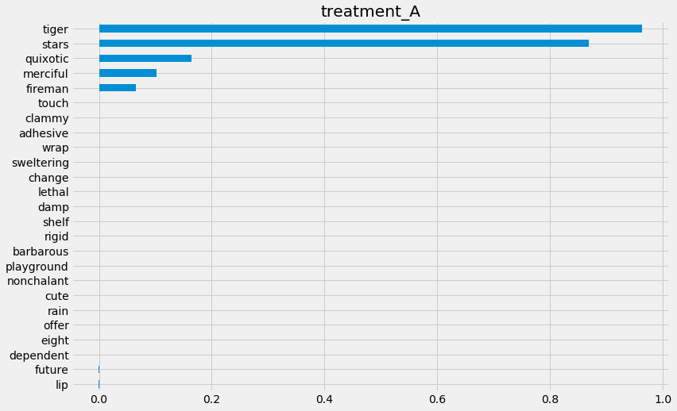
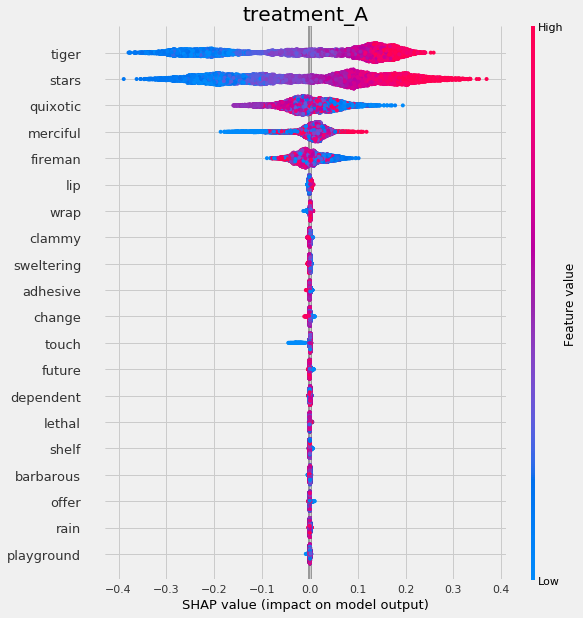
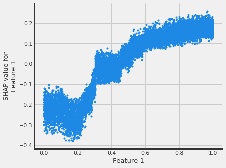
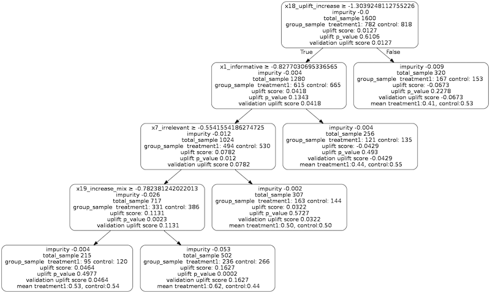
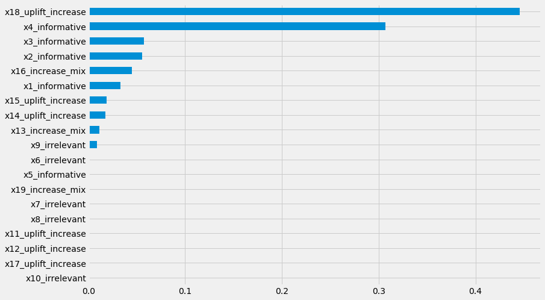

=======================
Interpretable Causal ML
=======================

Causal ML provides methods to interpret the treatment effect models trained, where we provide more sample code in `feature_interpretations_example.ipynb notebook <https://github.com/uber/causalml/blob/master/examples/feature_interpretations_example.ipynb>`_.

Meta-Learner Feature Importances
--------------------------------

.. code-block:: python

    from causalml.inference.meta import BaseSRegressor, BaseTRegressor, BaseXRegressor, BaseRRegressor

    slearner = BaseSRegressor(LGBMRegressor(), control_name='control')
    slearner.estimate_ate(X, w_multi, y)
    slearner_tau = slearner.fit_predict(X, w_multi, y)

    model_tau_feature = RandomForestRegressor()  # specify model for model_tau_feature

    slearner.get_importance(X=X, tau=slearner_tau, model_tau_feature=model_tau_feature,
                            normalize=True, method='auto', features=feature_names)

    # Using the feature_importances_ method in the base learner (LGBMRegressor() in this example)
    slearner.plot_importance(X=X, tau=slearner_tau, normalize=True, method='auto')

    # Using eli5's PermutationImportance
    slearner.plot_importance(X=X, tau=slearner_tau, normalize=True, method='permutation')

    # Using SHAP
    shap_slearner = slearner.get_shap_values(X=X, tau=slearner_tau)

    # Plot shap values without specifying shap_dict
    slearner.plot_shap_values(X=X, tau=slearner_tau)

    # Plot shap values WITH specifying shap_dict
    slearner.plot_shap_values(X=X, shap_dict=shap_slearner)

    # interaction_idx set to 'auto' (searches for feature with greatest approximate interaction)
    slearner.plot_shap_dependence(treatment_group='treatment_A',
                                feature_idx=1,
                                X=X,
                                tau=slearner_tau,
                                interaction_idx='auto')

Uplift Tree Visualization
-------------------------

.. code-block:: python

    from IPython.display import Image
    from causalml.inference.tree import UpliftTreeClassifier, UpliftRandomForestClassifier
    from causalml.inference.tree import uplift_tree_string, uplift_tree_plot
    from causalml.dataset import make_uplift_classification

    df, x_names = make_uplift_classification()
    uplift_model = UpliftTreeClassifier(max_depth=5, min_samples_leaf=200, min_samples_treatment=50,
                                        n_reg=100, evaluationFunction='KL', control_name='control')

    uplift_model.fit(df[x_names].values,
                    treatment=df['treatment_group_key'].values,
                    y=df['conversion'].values)

    graph = uplift_tree_plot(uplift_model.fitted_uplift_tree, x_names)
    Image(graph.create_png())

Please see below for how to read the plot, and `uplift_tree_visualization.ipynb example notebook <https://github.com/uber/causalml/blob/master/examples/uplift_tree_visualization.ipynb>`_ is provided in the repo.

- feature_name > threshold: For non-leaf node, the first line is an inequality indicating the splitting rule of this node to its children nodes.
- impurity: the impurity is defined as the value of the split criterion function (such as KL, Chi, or ED) evaluated at this current node
- total_sample: sample size in this node.
- group_sample: sample sizes by treatment groups
- uplift score: treatment effect in this node, if there are multiple treatment, it indicates the maximum (signed) of the treatment effects across all treatment vs control pairs.
- uplift p_value: p value of the treatment effect in this node
- validation uplift score:  all the information above is static once the tree is trained (based on the trained trees), while the validation uplift score represents the treatment effect of the testing data when the method fill() is used. This score can be used as a comparison to the training uplift score, to evaluate if the tree has an overfitting issue.

Uplift Tree Feature Importances
-------------------------

.. code-block:: python

    pd.Series(uplift_model.feature_importances_, index=x_names).sort_values().plot(kind='barh', figsize=(12,8))

