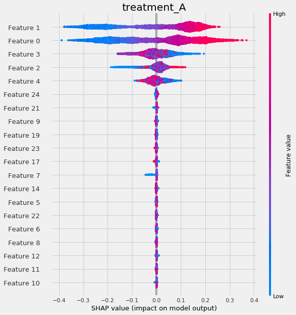

=======================
Interpretable Causal ML
=======================

Causal ML provides methods to interpret the treatment effect models trained.

Meta-Learner Feature Importances
--------------------------------

.. code-block:: python

    from causalml.inference.meta import BaseSRegressor, BaseTRegressor, BaseXRegressor, BaseRRegressor

    slearner = BaseSRegressor(LGBMRegressor(), control_name='control')
    slearner.estimate_ate(X, w_multi, y)
    slearner_tau = slearner.fit_predict(X, w_multi, y)

    model_tau_feature = RandomForestRegressor()  # specify model for model_tau_feature

    slearner.get_importance(X=X, tau=slearner_tau, model_tau_feature=model_tau_feature,
                            normalize=True, method='auto', features=feature_names)

    # Using the feature_importances_ method in the base learner (LGBMRegressor() in this example)
    slearner.plot_importance(X=X, tau=slearner_tau, normalize=True, method='auto')

    # Using eli5's PermutationImportance
    slearner.plot_importance(X=X, tau=slearner_tau, normalize=True, method='permutation')

    # Using SHAP
    shap_slearner = slearner.get_shap_values(X=X, tau=slearner_tau)

    # Plot shap values without specifying shap_dict
    slearner.plot_shap_values(X=X, tau=slearner_tau)

    # Plot shap values WITH specifying shap_dict
    slearner.plot_shap_values(shap_dict=shap_slearner)

    # interaction_idx set to 'auto' (searches for feature with greatest approximate interaction)
    slearner.plot_shap_dependence(treatment_group='treatment_A',
                                feature_idx=1,
                                X=X,
                                tau=slearner_tau,
                                interaction_idx='auto')

Uplift Tree Visualization
-------------------------

.. code-block:: python

    from IPython.display import Image
    from causalml.inference.tree import UpliftTreeClassifier, UpliftRandomForestClassifier
    from causalml.inference.tree import uplift_tree_string, uplift_tree_plot

    uplift_model = UpliftTreeClassifier(max_depth=5, min_samples_leaf=200, min_samples_treatment=50,
                                        n_reg=100, evaluationFunction='KL', control_name='control')

    uplift_model.fit(df[features].values,
                    treatment=df['treatment_group_key'].values,
                    y=df['conversion'].values)

    graph = uplift_tree_plot(uplift_model.fitted_uplift_tree, features)
    Image(graph.create_png())

.. image:: ./_static/img/uplift_tree_vis.png
    :width: 629
