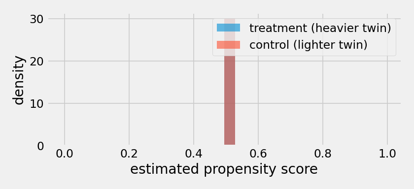
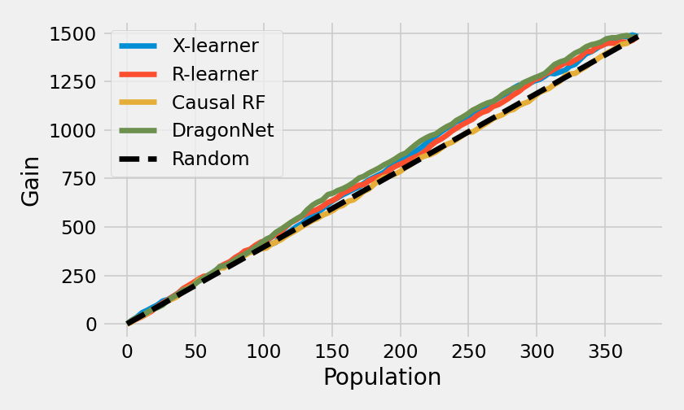
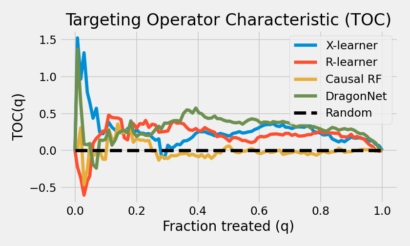

=========================================================
Estimating and Validating Heterogeneous Treatment Effects
=========================================================

This walkthrough trains four CATE estimators from different families -- two
meta-learners, a causal forest, and a neural network -- on the same data and
then does the part that is genuinely hard in causal ML: deciding which of them
to believe. The data is the IHDP benchmark, where the per-unit ground truth is
known -- so the validation methods you would use on real data can themselves
be checked against the right answer. Each step names the User Guide page that
covers it in depth. The dataset downloads on first use and is cached locally
(see :doc:`datasets`).

Step 1: State the question
==========================

The Infant Health and Development Program (IHDP) benchmark
:cite:`hill2011bayesian` starts from a real randomized trial of home visits
for premature infants, with a child's cognitive test score as the outcome. Two
modifications made it the standard testbed for heterogeneous-effect
estimation: a nonrandom subset of the treated group was removed, so treatment
assignment is confounded the way observational data is, and the outcomes are
simulated from the real covariates -- so both potential outcomes, and
therefore every unit's true effect, are known. Each of its 100 replications
simulates new outcomes for the same 747 units and draws its own 672/75
train-test split.

Step 2: Load the data
=====================

.. code-block:: python

    import numpy as np
    import pandas as pd
    from causalml.dataset import fetch_ihdp

    RS = 42
    np.random.seed(RS)

    train = fetch_ihdp(replication=0, split="train")
    test = fetch_ihdp(replication=0, split="test")
    X_tr = pd.DataFrame(train.data, columns=train.feature_names)
    w_tr, y_tr, tau_tr = train.treatment, train.target, train.tau
    X_te = pd.DataFrame(test.data, columns=test.feature_names)
    w_te, y_te, tau_te = test.treatment, test.target, test.tau

    print(X_tr.shape, w_tr.sum(), X_te.shape, w_te.sum())
    print("true ATE: %.3f | sd of tau: %.3f" % (tau_tr.mean(), tau_tr.std()))

.. code-block:: text

    (672, 25) 123 (75, 25) 16
    true ATE: 4.012 | sd of tau: 0.866

672 training units with 123 treated, 25 covariates, and -- because this is a
benchmark -- the true effect of every unit, held aside for scoring.

Step 3: State the identification and check overlap
==================================================

Before any estimation, state what makes the effect identifiable at all: we
assume treatment assignment is *unconfounded* given the 25 observed covariates
-- adjusting for them blocks every path by which assignment and outcome are
jointly determined, so the causal effect can be recovered from observational
data. Every estimator below stands on this assumption. On this benchmark it
holds by construction, because the outcomes were simulated from the observed
covariates alone; on real data it is untestable, which is why Step 8 stresses
it rather than verifying it.

Identification also needs *overlap*: treated and untreated units throughout
the covariate space (see
:ref:`Checking Overlap <validation:Checking Overlap>`). Estimate each unit's
probability of treatment -- the propensity score -- and compare its
distribution across groups. One practical note: on this data the model's
default cross-validation grid selects a penalty that collapses every score to
the treated share, so the grid is widened explicitly.

.. code-block:: python

    from causalml.propensity import ElasticNetPropensityModel

    pm = ElasticNetPropensityModel(Cs=np.logspace(0, 3, 8), random_state=RS)
    pm.fit(X_tr, w_tr)
    p_tr, p_te = pm.predict(X_tr), pm.predict(X_te)

The two distributions overlap over most of the range -- estimation is possible
-- but they are far from identical: the confounding introduced by removing
part of the treated group is exactly what this picture shows, and a spike of
near-zero-propensity controls marks a region with almost no treated
counterparts. On a randomized experiment this plot is flat.

Step 4: Train four estimators
=============================

One estimator from each corner of the library: an
:ref:`X-Learner <methodology:X-Learner>` and an
:ref:`R-Learner <methodology:R-Learner>` wrapping the same gradient-boosted
base learner, a :ref:`causal random forest <methodology:Honest estimation>`
with its default honest estimation, and :ref:`DragonNet
<methodology:DragonNet>`, a neural network built for exactly this kind of
problem. (DragonNet needs an optional extra -- ``pip install causalml[jax]``
for the implementation used here, or ``causalml[tf]`` for the TensorFlow one;
see :ref:`Installation <installation:Installation>`.)

.. code-block:: python

    from xgboost import XGBRegressor
    from causalml.inference.meta import BaseXRegressor, BaseRRegressor
    from causalml.inference.tree import CausalRandomForestRegressor
    from causalml.inference.jax import DragonNet

    learners = {
        "X-learner": BaseXRegressor(learner=XGBRegressor(random_state=RS)),
        "R-learner": BaseRRegressor(learner=XGBRegressor(random_state=RS)),
        "Causal RF": CausalRandomForestRegressor(random_state=RS),
        "DragonNet": DragonNet(verbose=False, seed=RS),
    }

    def fit_all(learners, X, w, y, p):
        for name, m in learners.items():
            if name in ("X-learner", "R-learner"):
                m.fit(X=X, treatment=w, y=y, p=p)
            else:
                m.fit(X=X, treatment=w, y=y)

    def predict_all(learners, X, p):
        out = {}
        for name, m in learners.items():
            if name == "X-learner":
                out[name] = m.predict(X=X, p=p).flatten()
            elif name == "DragonNet":
                out[name] = np.asarray(m.predict_tau(X)).flatten()
            else:
                out[name] = m.predict(X).flatten()
        return out

    fit_all(learners, X_tr, w_tr, y_tr, p_tr)

    print("ATE (truth: %.3f):" % tau_tr.mean())
    ate_x = learners["X-learner"].estimate_ate(X=X_tr, treatment=w_tr, y=y_tr,
                                               p=p_tr, pretrain=True)
    print("  X-learner  %.2f (%.2f, %.2f)" % ate_x)
    ate_r = learners["R-learner"].estimate_ate(X=X_tr, treatment=w_tr, y=y_tr,
                                               p=p_tr, pretrain=True)
    print("  R-learner  %.2f (%.2f, %.2f)" % ate_r)
    cate_tr = predict_all(learners, X_tr, p_tr)
    print("  Causal RF  %.2f (point estimate)" % cate_tr["Causal RF"].mean())
    print("  DragonNet  %.2f (point estimate)" % cate_tr["DragonNet"].mean())

.. code-block:: text

    ATE (truth: 4.012):
      X-learner  4.16 (4.07, 4.24)
      R-learner  4.14 (4.13, 4.15)
      Causal RF  3.99 (point estimate)
      DragonNet  3.87 (point estimate)

All four land near the truth. What each family reports differs -- the
meta-learners return an ATE interval from ``estimate_ate()``, the forest
offers per-prediction variances instead, and DragonNet reports a point
estimate (the full catalog is :doc:`inference`). Note the R-learner: the
narrowest interval on the table, and the only one that excludes the true
value. Precision is not accuracy, and nothing here says which estimator to
trust -- that takes the next two steps.

Step 5: Evaluate against the ground truth
=========================================

Predict each unit's effect on the held-out split and score it against the
truth: PEHE (precision in estimating heterogeneous effects -- the root mean
squared error of the per-unit estimates) and :func:`~causalml.metrics.ate_error`:

.. code-block:: python

    from causalml.metrics import pehe, ate_error

    cate_te = predict_all(learners, X_te, p_te)
    for name, c in cate_te.items():
        print("  %-10s PEHE %.3f  ate_error %+.3f"
              % (name, pehe(tau_te, c, squared=False), ate_error(tau_te, c)))

.. code-block:: text

      X-learner  PEHE 0.883  ate_error +0.164
      R-learner  PEHE 2.132  ate_error +0.395
      Causal RF  PEHE 0.797  ate_error +0.064
      DragonNet  PEHE 0.455  ate_error +0.034

With ground truth, evaluation is just measurement: DragonNet -- a network
whose architecture was designed against benchmarks like this one -- is the
most accurate, the forest and the X-learner follow, and the R-learner (with
this base learner and these defaults) is failing. On real data there is no
such measurement, which is the situation the next step simulates.

Step 6: Validate as if the truth were unknown
=============================================

Everything in this step uses only what real data provides: covariates,
treatment, outcome, and the models' predictions. The validation losses score
each model's predictions against a proxy for the true effect built by
cross-fitting on the held-out data -- the doubly robust (DR) pseudo-outcome
loss and the plug-in T-learner loss (see
:ref:`Model Selection with Validation Losses <validation:Model Selection with Validation Losses>`):

.. code-block:: python

    from causalml.metrics import dr_score, plug_in_t_score, rate_score

    df = pd.DataFrame({"y": y_te, "w": w_te, **cate_te})
    print(dr_score(df, X=X_te, outcome_col="y", treatment_col="w", p=p_te,
                   learner=XGBRegressor(random_state=RS),
                   return_ci=True, random_state=RS).round(3))
    print(plug_in_t_score(df, X=X_te, outcome_col="y", treatment_col="w",
                          learner=XGBRegressor(random_state=RS),
                          return_ci=True, random_state=RS).round(3))

.. code-block:: text

               dr_loss      se  ci_lower  ci_upper
    model
    X-learner   37.947  22.495    -6.142    82.036
    R-learner   44.465  24.535    -3.622    92.553
    Causal RF   38.482  22.476    -5.570    82.534
    DragonNet   40.687  24.687    -7.700    89.074

               plug_in_t_loss     se  ci_lower  ci_upper
    model
    X-learner           1.773  0.272     1.241     2.305
    R-learner           5.400  0.934     3.569     7.231
    Causal RF           1.396  0.244     0.917     1.875
    DragonNet           1.654  0.451     0.769     2.538

The plug-in loss, knowing nothing of the truth, reproduces its main verdict:
the R-learner is worst by a wide margin, and the other three sit within each
other's uncertainty. (It cannot resolve the top group's internal order -- it
puts the forest first where the truth puts DragonNet -- but it reliably
catches the failing model. The DR loss agrees on the ordering's tail but is
too noisy at this sample size to separate anything.)

The ranking metrics tell a sharper cautionary tale:

.. code-block:: python

    print(rate_score(df, outcome_col="y", treatment_col="w",
                     return_ci=True, random_state=RS).round(3))

.. code-block:: text

                rate     se  ci_lower  ci_upper  p_value
    model
    X-learner -0.166  0.191    -0.541     0.208    0.385
    R-learner  0.612  0.301     0.022     1.201    0.042
    Causal RF -0.143  0.291    -0.713     0.428    0.624
    DragonNet -0.080  0.183    -0.439     0.279    0.662

On 75 validation rows, the only nominally significant
:ref:`RATE <methodology:RATE>` belongs to the *worst* model in the lineup --
with four models tested at once, one accidental p < 0.05 is exactly what
noise produces. Small validation sets do not merely weaken rank-based
metrics; they can hand a significant-looking verdict to the wrong model. The
next step gives these metrics the sample size they need.

Step 7: Visualize the ranking with gain and TOC curves
======================================================

To see what the ranking metrics measure, pool the replication's 747 units and
re-split them in half, so the validation side has 374 rows instead of 75, and
refit the four learners on the other half:

.. code-block:: python

    import matplotlib.pyplot as plt
    from sklearn.model_selection import train_test_split
    from causalml.metrics import auuc_score, plot_gain, plot_toc

    X_all = pd.DataFrame(np.vstack([train.data, test.data]),
                         columns=train.feature_names)
    w_all = np.concatenate([train.treatment, test.treatment])
    y_all = np.concatenate([train.target, test.target])

    fit_idx, val_idx = train_test_split(np.arange(len(y_all)), test_size=0.5,
                                        random_state=RS, stratify=w_all)
    pm_v = ElasticNetPropensityModel(Cs=np.logspace(0, 3, 8), random_state=RS)
    pm_v.fit(X_all.iloc[fit_idx], w_all[fit_idx])
    p_fit = pm_v.predict(X_all.iloc[fit_idx])
    p_val = pm_v.predict(X_all.iloc[val_idx])

    learners_v = {
        "X-learner": BaseXRegressor(learner=XGBRegressor(random_state=RS)),
        "R-learner": BaseRRegressor(learner=XGBRegressor(random_state=RS)),
        "Causal RF": CausalRandomForestRegressor(random_state=RS),
        "DragonNet": DragonNet(verbose=False, seed=RS),
    }
    fit_all(learners_v, X_all.iloc[fit_idx], w_all[fit_idx],
            y_all[fit_idx], p_fit)
    cate_val = predict_all(learners_v, X_all.iloc[val_idx], p_val)

    df_val = pd.DataFrame({"y": y_all[val_idx], "w": w_all[val_idx], **cate_val})
    print(auuc_score(df_val, outcome_col="y", treatment_col="w",
                     return_ci=True, random_state=RS).round(3))

.. code-block:: text

                auuc     se  ci_lower  ci_upper
    model
    X-learner  0.527  0.014     0.500     0.554
    R-learner  0.525  0.013     0.499     0.552
    Causal RF  0.499  0.017     0.465     0.532
    DragonNet  0.540  0.013     0.514     0.566

The AUUC (area under the cumulative gain curve, normalized so 0.5 is random
targeting) now separates a little: DragonNet holds the largest margin over
random and is the only one whose interval clears 0.5, while the causal
forest's ranking is indistinguishable from random ordering. The gain curves
show how thin these margins are:

.. code-block:: python

    fig, ax = plt.subplots(figsize=(7, 4.2))
    plot_gain(df_val, outcome_col="y", treatment_col="w", ax=ax)

Every curve stays close to the random diagonal, because most units share a
similar effect: ranking cannot beat random by much when there is little
spread to exploit. Where the advantage sits matters, and that is what the TOC
curve isolates -- TOC(q) is the excess effect among the top-q fraction over
the overall ATE:

.. code-block:: python

    fig, ax = plt.subplots(figsize=(7, 4.2))
    plot_toc(df_val, outcome_col="y", treatment_col="w", ax=ax)

The X-learner's curve spikes to about 1.5 in the top few percent and decays;
DragonNet's advantage is smaller there but spread across the middle of the
ranking; the forest's curve sits near zero throughout. :ref:`RATE
<methodology:RATE>` with its default ``autoc`` weighting integrates the TOC
with weight :math:`1/q`, so it rewards exactly the early concentration the
X-learner has:

.. code-block:: python

    print(rate_score(df_val, outcome_col="y", treatment_col="w",
                     return_ci=True, random_state=RS).round(3))

.. code-block:: text

                rate     se  ci_lower  ci_upper  p_value
    model
    X-learner  0.381  0.191     0.006     0.757    0.046
    R-learner -0.012  0.148    -0.301     0.277    0.935
    Causal RF -0.009  0.277    -0.553     0.534    0.974
    DragonNet  0.277  0.267    -0.246     0.800    0.299

With five times the validation rows of Step 6, the spurious R-learner signal
is gone and the X-learner's RATE excludes zero (p = 0.046): its top-ranked
units demonstrably benefit more than average. Note the division of labor the
two metrics just displayed -- AUUC favored DragonNet's broad, thin margin;
RATE favored the X-learner's concentrated one. Neither is wrong; they answer
different targeting questions, which is why both exist.

Step 8: Stress the assumptions
==============================

Every estimate above leans on unconfoundedness: that the 25 covariates capture
everything driving both treatment and outcome. Sensitivity analysis (see
:ref:`Validation with Sensitivity Analysis <validation:Validation with Sensitivity Analysis>`)
perturbs the analysis and re-estimates. Replacing the treatment with random
noise -- the placebo test -- should destroy the effect; adding a random
covariate or halving the sample should not:

.. code-block:: python

    from causalml.metrics.sensitivity import Sensitivity

    df_s = X_tr.assign(treatment=w_tr, outcome=y_tr, p=p_tr)
    sens = Sensitivity(df=df_s, inference_features=list(X_tr.columns),
                       p_col="p", treatment_col="treatment",
                       outcome_col="outcome",
                       learner=BaseXRegressor(learner=XGBRegressor(random_state=RS)))
    print(sens.sensitivity_analysis(
        methods=["Placebo Treatment", "Random Cause", "Subset Data"],
        sample_size=0.5).to_string())

.. code-block:: text

                              Method     ATE   New ATE  New ATE LB  New ATE UB
    0              Placebo Treatment  4.1561 -0.208613   -0.313350   -0.103875
    1                   Random Cause  4.1561  4.013964    3.933172    4.094756
    2  Subset Data(sample size @0.5)  4.1561  3.939882    3.817171    4.062592

The placebo collapses the estimate by 95% -- not exactly to zero, since a
flexible learner finds some structure even in noise, but to the far side of
negligible -- while the other two perturbations barely move it. The analysis
is behaving the way a real effect should.

Step 9: The replication protocol
================================

IHDP results are published as a mean and standard error *across* replications
-- a single replication is not comparable to a published number. The loop is
the unit of comparison:

.. code-block:: python

    rows = []
    for rep in range(10):
        train = fetch_ihdp(replication=rep, split="train")
        test = fetch_ihdp(replication=rep, split="test")
        ...  # refit the four learners, score PEHE on the test split
    print(pd.DataFrame(rows).groupby("model")["pehe"].agg(["mean", "sem"]).round(3))

.. code-block:: text

                mean    sem
    model
    Causal RF  5.458  3.343
    DragonNet  0.599  0.054
    R-learner  4.729  1.843
    X-learner  3.524  2.031

The loop rewrites the single-replication story. A few replications simulate
heavy-tailed outcomes, and they blow up every estimator except DragonNet,
whose mean stays at 0.6 with a standard error fifty times smaller than the
others' -- while the causal forest, second-best on replication 0, has the
worst mean of all. A ranking read off one replication does not survive the
protocol, which is the reason the protocol exists. The
:doc:`benchmark leaderboard <examples/benchmark_leaderboard>` is the canonical
version of this loop, running all 100 replications of the file CausalML ships.

One caution when comparing against the literature: the CEVAE
:cite:`louizos2017causal` and DragonNet :cite:`shi2019adapting` papers report
IHDP as a mean and standard error over the *1,000-replication* release of this
same data-generating process (and DragonNet reports only the ATE error, not
PEHE), so their table values are not directly comparable to numbers computed
on the 100-replication file.

Summary
=======

The workflow, in the order this page ran it: state the identification and
check overlap before estimating; estimate the ATE and treat interval width
with suspicion; measure per-unit accuracy against ground truth where it
exists; validate blind with the DR and plug-in losses, which reliably catch a
failing model; give rank-based metrics enough validation data before trusting
them -- at 75 rows RATE crowned the worst model, at 374 it found the real
signal; read gain and TOC curves together, because AUUC and RATE reward
different shapes of heterogeneity; stress unconfoundedness with sensitivity
analysis; and never report a benchmark number from a single replication.

On this data: DragonNet was the most accurate and most stable per-unit
estimator, the X-learner had the most concentrated targeting signal, the
causal forest was accurate on average but ranked no better than random, and
the R-learner's confident-looking ATE interval concealed the worst per-unit
estimates in the lineup. Every one of those verdicts required a different
tool, and none of them is visible in Step 4's table of four plausible ATEs.

Where to next
=============

* Which estimator fits your problem: :doc:`choosing_an_estimator`
* The mathematics of each method: :doc:`methodology`
* The full evaluation workflow: :doc:`validation`
* What uncertainty each estimator reports: :doc:`inference`
* Interpreting a fitted model: :doc:`interpretation`
