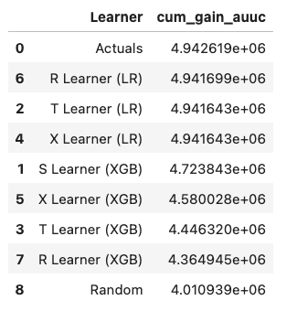
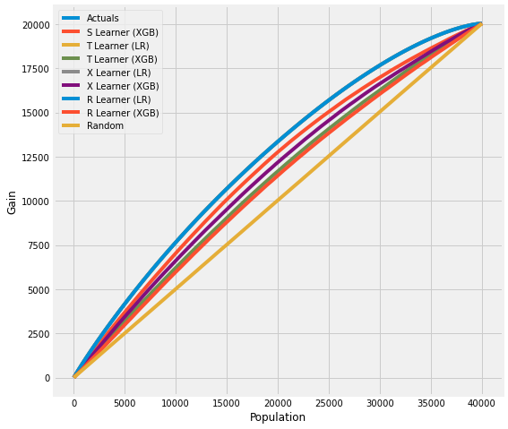

==========
Validation
==========

Estimation of the treatment effect cannot be validated the same way as regular ML predictions because the true value is not available except for the experimental data. Here we focus on the internal validation methods under the assumption of unconfoundedness of potential outcomes and the treatment status conditioned on the feature set available to us.

Validation with Multiple Estimates
----------------------------------

We can validate the methodology by comparing the estimates with other approaches, checking the consistency of estimates across different levels and cohorts.

Model Robustness for Meta Algorithms
~~~~~~~~~~~~~~~~~~~~~~~~~~~~~~~~~~~~

In meta-algorithms we can assess the quality of user-level treatment effect estimation by comparing estimates from different underlying ML algorithms. We will report MSE, coverage (overlapping 95% confidence interval), uplift curve. In addition, we can split the sample within a cohort and compare the result from out-of-sample scoring and within-sample scoring.

User Level/Segment Level/Cohort Level Consistency
~~~~~~~~~~~~~~~~~~~~~~~~~~~~~~~~~~~~~~~~~~~~~~~~~

We can also evaluate user-level/segment level/cohort level estimation consistency by conducting T-test.

Stability between Cohorts
~~~~~~~~~~~~~~~~~~~~~~~~~

Treatment effect may vary from cohort to cohort but should not be too volatile. For a given cohort, we will compare the scores generated by model fit to another score with the ones generated by its own model.

Validation with Synthetic Data Sets
-----------------------------------

We can test the methodology with simulations, where we generate data with known causal and non-causal links between the outcome, treatment and some of confounding variables.

We implemented the following sets of synthetic data generation mechanisms based on :cite:`nie2017quasi`:

Mechanism 1
~~~~~~~~~~~

| This generates a complex outcome regression model with easy treatment effect with input variables :math:`X_i \sim Unif(0, 1)^d`.
| The treatment flag is a binomial variable, whose d.g.p. is:
|
|   :math:`P(W_i = 1 | X_i) = trim_{0.1}(sin(\pi X_{i1} X_{i2})`
|
| With :
|   :math:`trim_\eta(x)=\max (\eta,\min (x,1-\eta))`
|
| The outcome variable is:
|
|   :math:`y_i = sin(\pi X_{i1} X_{i2}) + 2(X_{i3} - 0.5)^2 + X_{i4} + 0.5 X_{i5} + (W_i - 0.5)(X_{i1} + X_{i2})/ 2 + \epsilon_i`
|

Mechanism 2
~~~~~~~~~~~

| This simulates a randomized trial. The input variables are generated by :math:`X_i \sim N(0, I_{d\times d})`
|
| The treatment flag is generated by a fair coin flip:
|
|   :math:`P(W_i = 1|X_i) = 0.5`
|
| The outcome variable is
|
|   :math:`y_i = max(X_{i1} + X_{i2}, X_{i3}, 0) + max(X_{i4} + X_{i5}, 0) + (W_i - 0.5)(X_{i1} + \log(1 + e^{X_{i2}}))`
|

Mechanism 3
~~~~~~~~~~~

| This one has an easy propensity score but a difficult control outcome. The input variables follow :math:`X_i \sim N(0, I_{d\times d})`
|
| The treatment flag is a binomial variable, whose d.g.p is:
|
|   :math:`P(W_i = 1 | X_i) = \frac{1}{1+\exp{X_{i2} + X_{i3}}}`
|
| The outcome variable is:
|
|   :math:`y_i = 2\log(1 + e^{X_{i1} + X_{i2} + X_{i3}}) + (W_i - 0.5)`
|

Mechanism 4
~~~~~~~~~~~

| This contains an unrelated treatment arm and control arm, with input data generated by :math:`X_i \sim N(0, I_{d\times d})`.
|
| The treatment flag is a binomial variable whose d.g.p. is:
|
|   :math:`P(W_i = 1 | X_i) = \frac{1}{1+\exp{-X_{i1}} + \exp{-X_{i2}}}`
|
| The outcome variable is:
|
|   :math:`y_i = \frac{1}{2}\big(max(X_{i1} + X_{i2} + X_{i3}, 0) + max(X_{i4} + X_{i5}, 0)\big) + (W_i - 0.5)(max(X_{i1} + X_{i2} + X_{i3}, 0) - max(X_{i4}, X_{i5}, 0))`
|

Validation with Uplift Curve (AUUC)
----------------------------------

We can validate the estimation by evaluating and comparing the uplift gains with AUUC (Area Under Uplift Curve), it calculates cumulative gains. Please find more details in `meta_learners_with_synthetic_data.ipynb example notebook <https://github.com/uber/causalml/blob/master/examples/meta_learners_with_synthetic_data.ipynb>`_.

.. code-block:: python

    from causalml.dataset import *
    from causalml.metrics import *
    # Single simulation
    train_preds, valid_preds = get_synthetic_preds_holdout(simulate_nuisance_and_easy_treatment,
                                                           n=50000,
                                                           valid_size=0.2)
    # Cumulative Gain AUUC values for a Single Simulation of Validaiton Data
    get_synthetic_auuc(valid_preds)

For data with skewed treatment, it is sometimes advantageous to use :ref:`Targeted maximum likelihood estimation (TMLE) for ATE` to generate the AUUC curve for validation, as TMLE provides a more accurate estimation of ATE. Please find `validation_with_tmle.ipynb example notebook <https://github.com/uber/causalml/blob/master/examples/validation_with_tmle.ipynb>`_ for details.

Validation with Sensitivity Analysis
----------------------------------
Sensitivity analysis aim to check the robustness of the unconfoundeness assumption. If there is hidden bias (unobserved confounders), it detemineds how severe whould have to be to change conclusion by examine the average treatment effect estimation.

We implemented the following methods to conduct sensitivity analysis:

Placebo Treatment
~~~~~~~~~~~~~~~~~

| Replace treatment with a random variable.

Irrelevant Additional Confounder
~~~~~~~~~~~~~~~~~~~~~~~~~~~~~~~~

| Add a random common cause variable.

Subset validation
~~~~~~~~~~~~~~~~~

| Remove a random subset of the data.

Random Replace
~~~~~~~~~~~~~~

| Random replace a covariate with an irrelevant variable.

Selection Bias
~~~~~~~~~~~~~~

| `Blackwell(2013) <https://www.mattblackwell.org/files/papers/sens.pdf>` introduced an approach to sensitivity analysis for causal effects that directly models confounding or selection bias.
|
| One Sided Confounding Function: here as the name implies, this function can detect sensitivity to one-sided selection bias, but it would fail to detect other deviations from ignobility. That is, it can only determine the bias resulting from the treatment group being on average better off or the control group being on average better off.
|
| Alignment Confounding Function: this type of bias is likely to occur when units select into treatment and control based on their predicted treatment effects
|
| The sensitivity analysis is rigid in this way because the confounding function is not identified from the data, so that the causal model in the last section is only identified conditional on a specific choice of that function. The goal of the sensitivity analysis is not to choose the “correct” confounding function, since we have no way of evaluating this correctness. By its very nature, unmeasured confounding is unmeasured. Rather, the goal is to identify plausible deviations from ignobility and test sensitivity to those deviations. The main harm that results from the incorrect specification of the confounding function is that hidden biases remain hidden.
