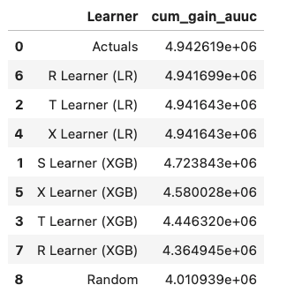
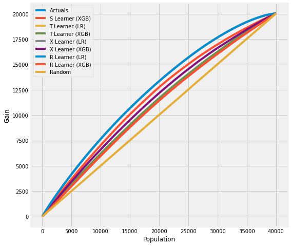

==========
Validation
==========

Estimation of the treatment effect cannot be validated the same way as regular ML predictions because the true value is not available except for the experimental data. Here we focus on the internal validation methods under the assumption of unconfoundedness of potential outcomes and the treatment status conditioned on the feature set available to us.

This page is ordered the way an analysis uses these checks. Before fitting,
confirm the data can support causal estimation at all by checking overlap.
After fitting, evaluate on held-out data: ranking metrics (AUUC and Qini) show
whether the model orders units by benefit, :ref:`RATE <methodology:RATE>` tests
whether that ordering beats random targeting, and validation losses compare
candidate models against a proxy for the unobservable true effect. Where ground
truth exists -- synthetic data and the :doc:`benchmark datasets <datasets>` --
error can be measured directly. Finally, stress the unconfoundedness assumption
itself with sensitivity analysis.

Checking Overlap
----------------

Every method on this page assumes *overlap* (also called positivity): each unit
must have a non-zero probability of receiving each treatment, so that both
potential outcomes are represented at every point of the covariate space where
effects are estimated. Where one group is absent, a CATE estimate is
extrapolation, and no held-out metric can detect that it is wrong.

Estimate propensity scores (e.g. with ``ElasticNetPropensityModel``; see the
:ref:`Propensity Score <quickstart:Propensity Score>` section of the
quickstart) and compare their distributions in the treatment and control
groups. Scores piling up near 0 or 1 signal weak overlap: estimators that
weight by inverse propensity become unstable there, which is why methods that
consume propensity scores commonly clip them away from the boundaries (e.g.
the ``p_clip_bounds`` argument of ``dr_score()``).

Validation with Uplift Curve (AUUC)
-----------------------------------

We can validate the estimation by evaluating and comparing the uplift gains with AUUC (Area Under Uplift Curve), it calculates cumulative gains. Please find more details in `meta_learners_with_synthetic_data.ipynb example notebook <https://github.com/uber/causalml/blob/master/docs/examples/meta_learners_with_synthetic_data.ipynb>`_.

Compute ranking metrics on data the model was not fitted on: the split search
inside any learner favors partitions whose in-sample effects look large, so
in-sample curves overstate targeting quality. For the same reason, comparing
average effects between subgroups that were themselves formed from the model's
in-sample scores does not validate the model -- the groups were chosen by the
very estimates being tested.

.. code-block:: python

    from causalml.dataset import *
    from causalml.metrics import *
    # Single simulation
    train_preds, valid_preds = get_synthetic_preds_holdout(simulate_nuisance_and_easy_treatment,
                                                           n=50000,
                                                           valid_size=0.2)
    # Cumulative Gain AUUC values for a Single Simulation of Validation Data
    get_synthetic_auuc(valid_preds)

``auuc_score()`` and ``qini_score()`` accept ``return_ci=True`` to report a
bootstrap standard error and confidence interval alongside each score, so two
models can be compared with their uncertainty in view rather than by point
estimates alone.

For data with skewed treatment, it is sometimes advantageous to use :ref:`Targeted maximum likelihood estimation (TMLE) for ATE <methodology:Targeted maximum likelihood estimation (TMLE) for ATE>` to generate the AUUC curve for validation, as TMLE provides a more accurate estimation of ATE. Please find `validation_with_tmle.ipynb example notebook <https://github.com/uber/causalml/blob/master/docs/examples/validation_with_tmle.ipynb>`_ for details.

Testing for Heterogeneity with RATE
-----------------------------------

A model can produce a plausible-looking uplift curve on data with no real
heterogeneity. ``rate_score()`` turns the ranking into a hypothesis test: the
Rank-Weighted Average Treatment Effect is the weighted area under the Targeting
Operator Characteristic curve, and with ``return_ci=True`` a confidence
interval that excludes zero is evidence the model's prioritization beats
treating at random. Use ``weighting="autoc"`` when effects are expected to
concentrate in a small subgroup and ``weighting="qini"`` when they are diffuse.
The mathematics, the weighting trade-off and the bootstrap are documented in
:ref:`RATE <methodology:RATE>`.

Model Selection with Validation Losses
--------------------------------------

To choose among candidate CATE models, score each against a proxy for the true
effect built on held-out folds. ``dr_score()`` measures the mean squared error
against a cross-fitted doubly robust (AIPW) pseudo-outcome, and
``plug_in_t_score()`` measures it against a cross-fitted T-learner proxy; both
are losses, so lower is better, and both accept ``return_ci=True``. The
constructions and their assumptions are documented in
:ref:`DR pseudo-outcome loss <methodology:DR (Doubly Robust) pseudo-outcome loss>`
and :ref:`Plug-in T-learner loss <methodology:Plug-in T-learner loss>`.

Validation with Ground Truth
----------------------------

Where the true effect is known, error can be measured directly instead of
through proxies: ``pehe()`` (precision in estimating heterogeneous effects, the
mean squared error of the CATE estimates), ``ate_error()`` for the average
effect, and ``policy_risk()`` for the treat-if-positive policy on randomized
data. These apply to synthetic data, to the semi-synthetic and randomized
:doc:`benchmark datasets <datasets>`, and nowhere else -- none of them can be
computed on ordinary observational data. The
:doc:`benchmark leaderboard notebook <examples/benchmark_leaderboard>` runs
CausalML's estimators through these metrics end to end.

Validation with Synthetic Data Sets
-----------------------------------

We can test the methodology with simulations, where we generate data with known causal and non-causal links between the outcome, treatment and some of confounding variables.

We implemented the following sets of synthetic data generation mechanisms based on :cite:`nie2017quasi`:

Mechanism 1
~~~~~~~~~~~

| This generates a complex outcome regression model with easy treatment effect with input variables :math:`X_i \sim Unif(0, 1)^d`.
| The treatment flag is a binomial variable, whose d.g.p. is:
|
|   :math:`P(W_i = 1 | X_i) = trim_{0.1}(sin(\pi X_{i1} X_{i2}))`
|
| With :
|   :math:`trim_\eta(x)=\max (\eta,\min (x,1-\eta))`
|
| The outcome variable is:
|
|   :math:`y_i = sin(\pi X_{i1} X_{i2}) + 2(X_{i3} - 0.5)^2 + X_{i4} + 0.5 X_{i5} + (W_i - 0.5)(X_{i1} + X_{i2})/ 2 + \epsilon_i`
|

Mechanism 2
~~~~~~~~~~~

| This simulates a randomized trial. The input variables are generated by :math:`X_i \sim N(0, I_{d\times d})`
|
| The treatment flag is generated by a fair coin flip:
|
|   :math:`P(W_i = 1|X_i) = 0.5`
|
| The outcome variable is
|
|   :math:`y_i = max(X_{i1} + X_{i2}, X_{i3}, 0) + max(X_{i4} + X_{i5}, 0) + (W_i - 0.5)(X_{i1} + \log(1 + e^{X_{i2}}))`
|

Mechanism 3
~~~~~~~~~~~

| This one has an easy propensity score but a difficult control outcome. The input variables follow :math:`X_i \sim N(0, I_{d\times d})`
|
| The treatment flag is a binomial variable, whose d.g.p is:
|
|   :math:`P(W_i = 1 | X_i) = \frac{1}{1+\exp{X_{i2} + X_{i3}}}`
|
| The outcome variable is:
|
|   :math:`y_i = 2\log(1 + e^{X_{i1} + X_{i2} + X_{i3}}) + (W_i - 0.5)`
|

Mechanism 4
~~~~~~~~~~~

| This contains an unrelated treatment arm and control arm, with input data generated by :math:`X_i \sim N(0, I_{d\times d})`.
|
| The treatment flag is a binomial variable whose d.g.p. is:
|
|   :math:`P(W_i = 1 | X_i) = \frac{1}{1+\exp{-X_{i1}} + \exp{-X_{i2}}}`
|
| The outcome variable is:
|
|   :math:`y_i = \frac{1}{2}\big(max(X_{i1} + X_{i2} + X_{i3}, 0) + max(X_{i4} + X_{i5}, 0)\big) + (W_i - 0.5)(max(X_{i1} + X_{i2} + X_{i3}, 0) - max(X_{i4} + X_{i5}, 0))`
|

Validation with Multiple Estimates
----------------------------------

We can validate the methodology by comparing the estimates with other approaches, checking the consistency of estimates across different levels and cohorts.

Model Robustness for Meta Algorithms
~~~~~~~~~~~~~~~~~~~~~~~~~~~~~~~~~~~~

In meta-algorithms we can assess the quality of user-level treatment effect estimation by comparing estimates from different underlying ML algorithms. We will report MSE, coverage (overlapping 95% confidence interval), uplift curve. In addition, we can split the sample within a cohort and compare the result from out-of-sample scoring and within-sample scoring.

User Level/Segment Level/Cohort Level Consistency
~~~~~~~~~~~~~~~~~~~~~~~~~~~~~~~~~~~~~~~~~~~~~~~~~

We can also evaluate user-level/segment level/cohort level estimation consistency by conducting T-test.

Stability between Cohorts
~~~~~~~~~~~~~~~~~~~~~~~~~

Treatment effect may vary from cohort to cohort but should not be too volatile. For a given cohort, we will compare the scores generated by model fit to another score with the ones generated by its own model.

Validation with Sensitivity Analysis
------------------------------------
Sensitivity analysis aims to check the robustness of the unconfoundedness assumption. If there is hidden bias (unobserved confounders), it determines how severe that bias would have to be to change the conclusion, by examining the average treatment effect estimation.

We implemented the following methods to conduct sensitivity analysis. The heading of each is the string to pass to ``Sensitivity.sensitivity_analysis(methods=[...])``:

Placebo Treatment
~~~~~~~~~~~~~~~~~

| Replace treatment with a random variable.

Random Cause
~~~~~~~~~~~~

| Add a random common cause variable.

Subset Data
~~~~~~~~~~~

| Remove a random subset of the data.

Random Replace
~~~~~~~~~~~~~~

| Randomly replace a covariate with an irrelevant variable.

Selection Bias
~~~~~~~~~~~~~~

| `Blackwell (2013) <https://www.mattblackwell.org/files/papers/sens.pdf>`_ introduced an approach to sensitivity analysis for causal effects that directly models confounding or selection bias.
|
| One Sided Confounding Function: here as the name implies, this function can detect sensitivity to one-sided selection bias, but it would fail to detect other deviations from ignorability. That is, it can only determine the bias resulting from the treatment group being on average better off or the control group being on average better off.
|
| Alignment Confounding Function: this type of bias is likely to occur when units select into treatment and control based on their predicted treatment effects
|
| The sensitivity analysis is rigid in this way because the confounding function is not identified from the data, so that the causal model in the last section is only identified conditional on a specific choice of that function. The goal of the sensitivity analysis is not to choose the “correct” confounding function, since we have no way of evaluating this correctness. By its very nature, unmeasured confounding is unmeasured. Rather, the goal is to identify plausible deviations from ignorability and test sensitivity to those deviations. The main harm that results from the incorrect specification of the confounding function is that hidden biases remain hidden.
