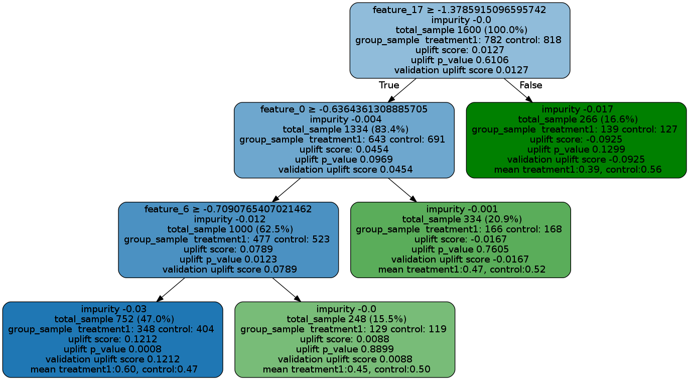

==============
Visualization
==============

Visualization functions are provided for uplift trees for model interpretation and diagnosis.

Supported Models
--------------------------
These visualization functions work only for tree-based classification algorithms:

- Uplift tree/random forests on KL divergence, Euclidean Distance, and Chi-Square
- Uplift tree/random forests on Contextual Treatment Selection

Currently, they are NOT supporting Meta-learner algorithms

- S-learner
- T-learner
- X-learner
- R-learner

Supported Usage
--------------------------

The visualization method supports both uplift tree and uplift random forest:

- Visualize a trained uplift classification tree model
- Visualize an uplift tree in a trained uplift random forests

It supports both tree based on training data and tree based on testing data for validation purpose:

- Visualize the validation tree: fill the trained uplift classification tree with testing (or validation) data, and show the statistics for both training data and testing data

It supports multiple treatment groups 

- Visualize the case where there are one control group and multiple treatment groups

How to Read the Plot
-----------------------------------

- feature_name > threshold: For non-leaf node, the first line is an inequality indicating the splitting rule of this node to its children nodes.
- impurity: the impurity is defined as the value of the split criterion function (such as KL, Chi, or ED) evaluated at this current node
- total_sample: sample size in this node.
- group_sample: sample sizes by treatment groups
- uplift score: treatment effect in this node, if there are multiple treatment, it indicates the maximum (signed) of the treatment effects across all treatment vs control pairs.
- uplift p_value: p value of the treatment effect in this node
- validation uplift score:  all the information above is static once the tree is trained (based on the trained trees), while the validation uplift score represents the treatment effect of the testing data when the method fill() is used. This score can be used as a comparison to the training uplift score, to evaluate if the tree has an overfitting issue. 

An example notebook is provided in the /examples folder in the repo. 

